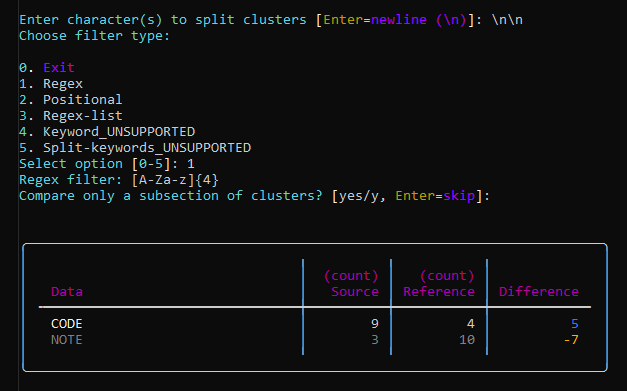
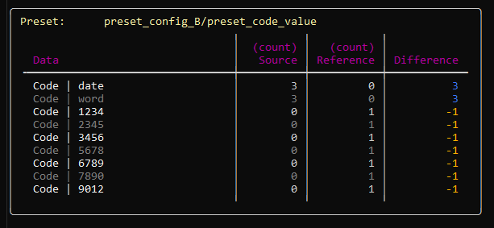
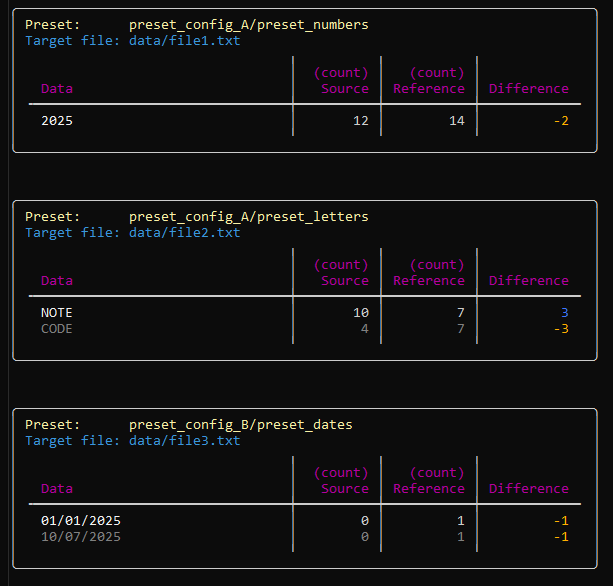
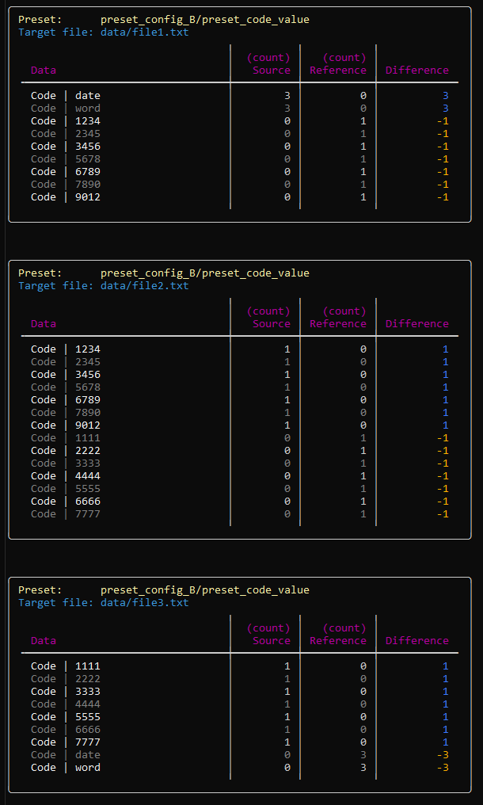

# [GenEC: Generic Extraction & Comparison Tool](https://github.com/RemyKroese/GenEC)

<div align="center">
  
</div>

[](https://github.com/RemyKroese/GenEC/actions)
[](https://codecov.io/gh/RemyKroese/GenEC)
[](https://github.com/RemyKroese/GenEC/releases/latest)
[]()
[](https://github.com/RemyKroese/GenEC/commits)
[](./LICENSE)
[](https://github.com/RemyKroese/GenEC)


### 1.0.0 release progress

`█████████████████████████████████████████████████████████████████████████████████████████████████   `


## Overview

GenEC (Generic Extraction & Comparison) is a Python-based tool for extracting structured data from files or folders.
It offers a flexible, one-size-fits-all extraction framework that you can tailor precisely using configuration parameters.

With presets and preset lists, you can easily repeat your extraction methods on single files or entire directories.
Beyond extraction, GenEC can also compare the extracted data against reference files or folders to highlight differences.

Designed for users of all technical levels, GenEC supports both manual workflows and automated pipelines,
making data analysis straightforward and accessible.

## Installation

GenEC requires **Python 3.9 or higher**

### Using uv (recommended)

For execution:
```bash
pip install uv
uv sync
uv run <command>
```

For developing:
```bash
uv sync --group dev   # include dev packages
uv sync --group dist  # include distribution packages
```

---

## Usage

GenEC supports three workflow commands, which utilize different CLI arguments:
- **basic** — define extraction and comparison directly at runtime.
- **preset** — use a single YAML preset for configuration.
- **preset-list** — run bulk analysis with multiple presets listed in a YAML file.


### Common Arguments

| Argument             | Short | Required | Description                                                        |
|----------------------|-------|----------|--------------------------------------------------------------------|
| `--source`           | `-s`  | Yes      | Path to the source for data extraction.                      |
| `--reference`        | `-r`  | No       | Path to the reference for comparison. |
| `--output-directory` | `-o`  | No       | Directory to save output files. |
| `--output-types`     | `-t`  | No       | List of output file types to generate. Choices: `csv`, `json`, `txt`, `yaml`. Note that multiple can be selected. |

*`--source` and `--reference` arguments accept **file paths** for the basic and preset workflows, and **directory paths** when using `preset-list` workflow.

**`--output-directory` and `--output-types` must be used together.

### Workflow-Specific Arguments

| Workflow       | Argument              | Short | Required | Description                                               |
|----------------|-----------------------|-------|----------|-----------------------------------------------------------|
| **basic**      | (none additional)     |       |          | Extraction strategy defined at runtime.     |
| **preset**     | `--preset`            | `-p`  | Yes      | Extraction strategy determined through a preset.     |
|                | `--presets-directory` | `-d`  | No       | Directory containing preset YAML files (default: `GenEC/presets/`). |
| **preset-list**| `--preset-list`       | `-l`  | Yes      | YAML file listing multiple presets for batch processing.  |
|                | `--presets-directory` | `-d`  | No       | Directory containing preset YAML files (default: `GenEC/presets/`). |
|                | `--target-variables`  |       | No       | Key-value pairs (`key=value`) to dynamically substitute variables in preset target paths. Can be specified multiple times.|

### Example Commands

#### Basic workflow

```bash
python -m GenEC.main basic -s <source_file> [options]

python -m GenEC.main basic -s <source_file> -r <reference_file> -o <output_directory> -t txt csv json yaml
```

#### Preset workflow

```bash
python -m GenEC.main preset -s <source_file> -p <file_name_without_extension/preset_name> -d <presets_directory> [options]
```

#### Preset-list workflow

```bash
python -m GenEC.main preset-list -s <source_directory> -l <preset_list_file> -d <presets_directory> [options]

python -m GenEC.main preset-list -s <source_directory> -l <preset_list_file> -d <presets_directory> -v myvar1=value1 myvar2=value2
```

---

## Quick-start

### Basic workflow
```bash
uv run python GenEC/main.py basic -s docs/demos/quick_start/source/data/file1.txt -r docs/demos/quick_start/source/data/file2.txt
```
[Output files (`-o docs/demos/quick_start/basic_output -t txt csv json yaml`)](docs/demos/quick_start/basic_output//file1/)

[](docs/demos/quick_start/basic_result.png)


### Preset workflow
```bash
uv run python GenEC/main.py preset -s docs/demos/quick_start/source/data/file1.txt -r docs/demos/quick_start/source/data/file2.txt -p preset_config_B/preset_code_value -d docs/demos/quick_start/presets/
```
[Output files (`-o docs/demos/quick_start/preset_output -t txt csv json yaml`)](docs/demos/quick_start/preset_output/file1/)

[](docs/demos/quick_start/preset_result.png)


### Preset-list workflow
```bash
uv run python GenEC/main.py preset-list -s docs/demos/quick_start/source -r docs/demos/quick_start/reference/ -l preset-list_config -d docs/demos/quick_start/presets/ -v var1=file1 var2=file2 var3=file3
```
[Output files (`-o docs/demos/quick_start/preset-list_output -t txt csv json yaml`)](docs/demos/quick_start/preset-list_output/source/)

[](docs/demos/quick_start/preset-list_normal_values_result.png)

[](docs/demos/quick_start/preset-list_code_values_result.png)


---

## Configuration

GenEC allows customization through YAML configuration files. A sample preset  may look like:

```yaml
preset_a:
  cluster_filter: '\n'
  text_filter_type: 'Regex'
  text_filter: '\| ([A-Za-z]+) \|'
  should_slice_clusters: false
  src_start_cluster_text: ''
  src_end_cluster_text: ''
  ref_start_cluster_text: ''
  ref_end_cluster_text: ''
```

Note that GenEC can use grouping within the Regex filter type `()` to construct more complex output data.

Modify these parameters according to your extraction and comparison needs. Please see the [Sample preset
YAML](GenEC/presets/sample_preset.yaml) for more information. Creation of more in-depth documentation on these yaml configurations
files is still in progress.

---

## Testing

Run the test suite from the root directory. Requires dev packages to be installed

### Full test
```bash
uv run pytest
```

### Coverage
```bash
uv run pytest --cov=. --cov-branch
```

### Subtests
```bash
uv run pytest -m system                                   # Runs system-level tests

uv run pytest -m unit                                     # Runs unit tests
```

### Repeat tests
```bash
uv run pytest --count 10
```

### Linting & Type Checking
```bash
uv run flake8                                             # Code style and formatting

uv run mypy .                                             # Type checking

uv run pylint GenEC --score=yes                           # Production code linting (strict)
uv run pylint tests --rcfile=tests/.pylintrc --score=yes  # Test code linting (relaxed)
```

### Pre-commit Hooks
```bash
uv run pre-commit                                         # Run pre-commit hooks on staged files

uv run pre-commit run --all-files                         # Run pre-commit hooks on all files
```

## License
Copyright [2025] [Remy Kroese]

Licensed under the Apache License, Version 2.0. See the [LICENSE](LICENSE) file for details.
