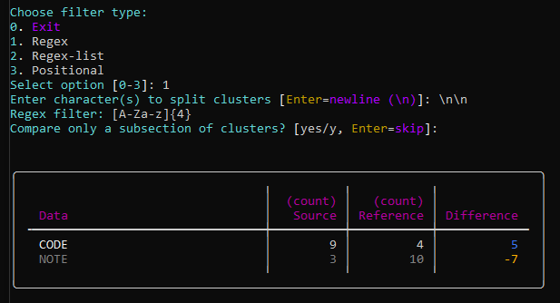

# [GenEC: Generic Extraction & Comparison Tool](https://github.com/RemyKroese/GenEC)

<div align="center">
  
</div>

[](https://github.com/RemyKroese/GenEC/actions)
[](https://codecov.io/gh/RemyKroese/GenEC)
[](https://github.com/RemyKroese/GenEC/releases/latest)
[](https://github.com/RemyKroese/GenEC/commits)
[](./LICENSE)
[](https://github.com/RemyKroese/GenEC)


## Overview

GenEC (Generic Extraction & Comparison) is a Python-based tool for extracting structured data from files or folders.
It offers a flexible, one-size-fits-all extraction framework that you can tailor precisely using configuration parameters.

With presets and preset lists, you can easily repeat your extraction methods on single files or entire directories.
Beyond extraction, GenEC can also compare the extracted data against reference files or folders to highlight differences.

Designed for users of all technical levels, GenEC supports both manual workflows and automated pipelines,
making data analysis straightforward and accessible.

## Quick Navigation

| Getting Started | Workflows | Text Filters | Configuration |
|----------------|-----------|--------------|---------------|
| [Documentation](docs/overview.md) | [Basic](docs/workflows/basic.md) | [Regex](docs/filters/regex.md) | [Output Formats](docs/configuration/output-formats.md) |
| [Setup Guide](docs/setup.md) | [Preset](docs/workflows/preset.md) | [Regex-list](docs/filters/regex-list.md) | [Presets](docs/configuration/preset.md) |
|  | [Preset-list](docs/workflows/preset-list.md) | [Positional](docs/filters/positional.md) | [Preset-lists](docs/configuration/preset-list.md) |

## Installation

GenEC requires **Python 3.9 or higher**

### Using uv (recommended)

For execution:
```bash
pip install uv
uv sync
uv run python GenEC/main.py --help
```

For developing:
```bash
uv sync --group dev   # include dev packages
uv sync --group dist  # include distribution packages
```

---

## Usage

GenEC supports three workflow commands with different automation levels and use cases, as well as 3 different filter types:

**Workflows**
- **[basic](docs/workflows/basic.md)** - Interactive configuration at runtime. Perfect for learning and experimentation.
- **[preset](docs/workflows/preset.md)** - YAML-based automation for single files. Ideal for repeated analysis tasks.
- **[preset-list](docs/workflows/preset-list.md)** - Batch processing with multiple presets. Best for comprehensive analysis workflows.

**Filter types**
- **[Regex](docs/filters/regex.md)** - Pattern-based matching using regex.
- **[Regex-list](docs/filters/regex-list.md)** - Complex pattern-based matching using more than 1 regex.
- **[Positional](docs/filters/positional.md)** - Position-based matching using line numbers and positions on the line itself.


### Common Arguments

| Argument             | Short | Required | Description                                                        |
|----------------------|-------|----------|--------------------------------------------------------------------|
| `--source`           | `-s`  | Yes      | Path to the source for data extraction.                      |
| `--reference`        | `-r`  | No       | Path to the reference for comparison. |
| `--output-directory` | `-o`  | No       | Directory to save output files (terminal-only by default). |
| `--output-types`     | `-t`  | No       | List of output file types to generate. Choices: `csv`, `json`, `txt`, `yaml`. Note that multiple can be selected. |

`--source` and `--reference` arguments accept **file paths** for the basic and preset workflows, and **directory paths** when using `preset-list` workflow.

`--output-directory` and `--output-types` must be used together. Without these parameters, results are displayed in terminal only.

### Workflow-Specific Arguments

| Workflow       | Argument              | Short | Required | Description                                               |
|----------------|-----------------------|-------|----------|-----------------------------------------------------------|
| **basic**      | (none additional)     |       |          | Interactive configuration - [Learn more →](docs/workflows/basic.md)     |
| **preset**     | `--preset`            | `-p`  | Yes      | YAML preset reference - [Learn more →](docs/workflows/preset.md)     |
|                | `--presets-directory` | `-d`  | No       | Directory containing preset YAML files (default: `GenEC/presets/`). |
| **preset-list**| `--preset-list`       | `-l`  | Yes      | Batch processing configuration - [Learn more →](docs/workflows/preset-list.md)  |
|                | `--presets-directory` | `-d`  | No       | Directory containing preset YAML files (default: `GenEC/presets/`). |
|                | `--target-variables`  | `-v`  | No       | Key-value pairs (`key=value`) for variable substitution. Can be specified multiple times.|
|                | `--print-results`     |       | No       | Print results to CLI (disabled by default when output files are specified for performance). |

### Example Commands

#### Basic workflow

```bash
uv run python GenEC/main.py basic -s <source_file> [options]

uv run python GenEC/main.py basic -s <source_file> -r <reference_file> -o <output_directory> -t txt csv json yaml
```

#### Preset workflow

```bash
uv run python GenEC/main.py preset -s <source_file> -p <file_name_without_extension/preset_name> -d <presets_directory> [options]
```

#### Preset-list workflow

```bash
uv run python GenEC/main.py preset-list -s <source_directory> -l <preset_list_file> -d <presets_directory> [options]

uv run python GenEC/main.py preset-list -s <source_directory> -l <preset_list_file> -d <presets_directory> -v myvar1=value1 myvar2=value2
```

---

## Examples

### Basic workflow
```bash
uv run python GenEC/main.py basic -s docs/demos/quick_start/source/data/file1.txt -r docs/demos/quick_start/source/data/file2.txt
```
[Output files (`-o docs/demos/quick_start/basic_output -t txt csv json yaml`)](docs/demos/quick_start/basic_output//file1/)

[](docs/demos/quick_start/basic_result.png)


### Preset workflow
```bash
uv run python GenEC/main.py preset -s docs/demos/quick_start/source/data/file1.txt -r docs/demos/quick_start/source/data/file2.txt -p preset_config_B/preset_code_value -d docs/demos/quick_start/presets/
```
[Output files (`-o docs/demos/quick_start/preset_output -t txt csv json yaml`)](docs/demos/quick_start/preset_output/file1/)

[](docs/demos/quick_start/preset_result.png)


### Preset-list workflow
```bash
uv run python GenEC/main.py preset-list -s docs/demos/quick_start/source -r docs/demos/quick_start/reference/ -l preset-list_config -d docs/demos/quick_start/presets/ -v var1=file1 var2=file2 var3=file3
```
[Output files (`-o docs/demos/quick_start/preset-list_output -t txt csv json yaml`)](docs/demos/quick_start/preset-list_output/source/)

[](docs/demos/quick_start/preset-list_normal_values_result.png)

[](docs/demos/quick_start/preset-list_code_values_result.png)


---

## Configuration

GenEC offers powerful configuration through YAML preset files that define extraction and comparison strategies. This enables consistent, repeatable analysis workflows.

**Basic preset structure:**
```yaml
preset_name:
  cluster_filter: '\n'                    # How to split text into processable chunks
  text_filter_type: 'Regex'               # Filter method: 'Regex', 'Regex-list', 'Positional'
  text_filter: '\| ([A-Za-z]+) \|'        # Extraction pattern (varies by filter type)
  should_slice_clusters: false            # Enable/disable cluster range selection
```

GenEC supports advanced features including:
- **Variable substitution** - Dynamic target paths in preset-lists
- **Cluster slicing** - Process specific sections of large files
- **YAML inheritance** - Reusable configuration templates
- **Multiple output formats** - JSON, CSV, TXT, YAML

**Configuration Documentation:**
- **[Preset Configuration](docs/configuration/preset.md)**
- **[Preset-List Configuration](docs/configuration/preset-list.md)**
- **[Output Formats](docs/configuration/output-formats.md)**

---

## Testing

> **Prerequisites**: Ensure GenEC is properly installed → [Setup and Installation](docs/setup.md)

Run the test suite from the root directory. Requires dev packages to be installed

### Full test
```bash
uv run pytest
```

### Coverage
```bash
uv run pytest --cov=. --cov-branch
```

### Subtests
```bash
uv run pytest -m system                                   # Runs system-level tests

uv run pytest -m unit                                     # Runs unit tests
```

### Repeat tests
```bash
uv run pytest --count 10
```

### Linting & Type Checking
```bash
uv run flake8                                             # Code style and formatting

uv run mypy .                                             # Type checking

uv run pylint GenEC --score=yes                           # Production code linting (strict)
uv run pylint tests --rcfile=tests/.pylintrc --score=yes  # Test code linting (relaxed)
```

### Pre-commit Hooks
```bash
uv run pre-commit                                         # Run pre-commit hooks on staged files

uv run pre-commit run --all-files                         # Run pre-commit hooks on all files
```

## License
Copyright [2025] [Remy Kroese]

Licensed under the Apache License, Version 2.0. See the [LICENSE](LICENSE) file for details.
